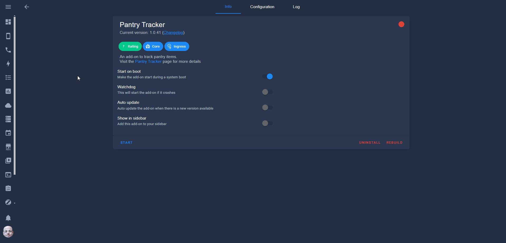

# HomeAssistant Pantry

> [!WARNING]
> This repo has been archived - New project at [https://github.com/mintcreg/pantry_tracker](https://github.com/mintcreg/pantry_tracker).

# Description
This addon allows you to maintain products for your kitchen/pantry or whatever your use case may be. This utilised the HA API to create entities (which will be your products).

**Features**
- Responsive
- Product Management
- Category Management
- Assign products to categories
- Ingress


FAQ: [Read Here](FAQ.md).

**Install Steps**
```bash
  1: Place pantry_tracker in /addons
  
  2: Start the addon
``` 
 

## Screenshots & Video


 



# Roadmap
```bash
  > Provide an option to delete items (currently not functional)
  
  > Integrate with UPC/EAN Database

  > Provide functionality for barcode scanning to add/remove/increase/decrease quantities
``` 


